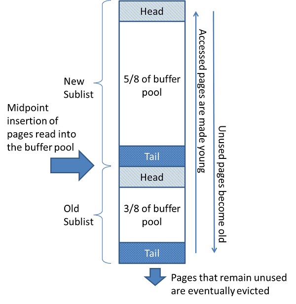

# InnoDB存储引擎

## 15.1 InnoDB概论

InnoDB是一个通用存储引擎，它平衡了高可靠性和高性能。在MySQL 8.0中，InnoDB是默认的MySQL存储引擎。除非您已经配置了一个不同的默认存储引擎，否则，发出一个不带engine =子句的CREATE TABLE语句将创建一个InnoDB表

#### InnoDB的主要优点

* 它的DML操作遵循ACID模型，事务具有提交、回滚和崩溃恢复功能，以保护用户数据。更多信息请参见15.2节“InnoDB和ACID模型”
* 行级锁和oracle风格的一致性读取提高了多用户并发性和性能。更多信息请参见15.7节“InnoDB锁定和事务模型”
* InnoDB表将你的数据排列在磁盘上，以优化基于主键的查询。每个InnoDB表都有一个主键索引，称为聚集索引，用于组织数据以最小化主键查找的I/O。更多信息请参见15.6.2.1节“聚集和二级索引”
* 为了保持数据的完整性，InnoDB支持外键约束。使用外键时，将检查插入、更新和删除，以确保它们不会导致不同表之间的不一致。更多信息请参见13.1.20.5节“外键约束”

表15.1 InnoDB存储引擎特性

| 特性                                                      | 支持                                                         |
| --------------------------------------------------------- | ------------------------------------------------------------ |
| B-tree indexes                                            | Yes                                                          |
| 备份/时间点恢复(在服务器中实现，而不是在存储引擎中实现)。 | Yes                                                          |
| 集群数据库支持                                            | No                                                           |
| 聚簇索引                                                  | Yes                                                          |
| 数据压缩                                                  | Yes                                                          |
| 数据缓存                                                  | Yes                                                          |
| 数据加密                                                  | Yes(在服务器上通过加密功能实现;在MySQL 5.7及以后版本中，支持静态数据表空间加密。) |
| 外键支持                                                  | Yes                                                          |
| 全文搜索索引                                              | Yes(InnoDB对全文索引的支持在MySQL 5.6和更高版本中是可用的。) |
| 地理空间数据类型支持                                      | Yes(InnoDB对地理空间索引的支持在MySQL 5.7和更高版本中是可用的)。 |
| 地理空间索引支持                                          | Yes                                                          |
| hash索引                                                  | No(InnoDB内部利用哈希索引来实现自适应哈希索引特性。)         |
| 索引缓存                                                  | Yes                                                          |
| 锁粒度                                                    | Row                                                          |
| MVVC                                                      | Yes                                                          |
| 复制支持(在服务器中实现，而不是在存储引擎中实现)。        | Yes                                                          |
| 存储限制                                                  | 64TB                                                         |
| T-tree索引                                                | No                                                           |
| 事务                                                      | Yes                                                          |
| 更新数据字典的统计信息                                    | Yes                                                          |

要比较InnoDB和MySQL提供的其他存储引擎的特性，请参阅第16章“可选的存储引擎”中的存储引擎特性表。

#### InnoDB增强和新特性

有关InnoDB增强和新特性的信息，请参阅：

* 在1.4节“MySQL 8.0的新特性”中列出了InnoDB的增强列表。
* 发行说明。

#### 额外的InnoDB信息和资源

* 有关innodb相关术语和定义，请参阅MySQL术语表
* 关于InnoDB存储引擎的论坛，请参阅 [MySQL Forums::InnoDB](http://forums.mysql.com/list.php?22).
* InnoDB是在与MySQL相同的GNU GPL许可版本2(1991年6月)下发布的。有关MySQL许可的更多信息，请参见http://www.mysql.com/company/legal/licensing/。

### 15.1.1 使用InnoDB表的好处

你可能会发现InnoDB表很有用，原因如下：

* 如果服务器因为硬件或软件问题而崩溃，无论当时数据库中发生了什么，在重新启动数据库后都不需要做任何特殊操作。InnoDB"崩溃恢复（[crash recovery](https://dev.mysql.com/doc/refman/8.0/en/glossary.html#glos_crash_recovery)）"自动恢复崩溃前提交的所有更改，并撤销所有正在进行但未提交的更改。只需要重启然后在你停止的地方继续操作
* InnoDB存储引擎有自己的缓冲池（ [buffer pool](https://dev.mysql.com/doc/refman/8.0/en/glossary.html#glos_buffer_pool)），在访问数据时可以在主存中缓存表和索引数据。经常使用的数据直接在内存中处理。此缓存适用于许多类型的信息，能够加快处理速度。在专用数据库服务器上，通常会将高达80%的物理内存分配给缓冲池
* 如果将相关数据分割到不同的表中，则可以设置执行参照完整性（[referential integrity](https://dev.mysql.com/doc/refman/8.0/en/glossary.html#glos_referential_integrity)）的外键。更新或删除数据，其他表中的相关数据将自动更新或删除。如果尝试将数据插入到一个辅助表中，而主表中没有相应的数据，那么错误的数据将自动被踢出
* 如果磁盘或内存中的数据损坏，在使用伪数据之前，校验和机制会向您发出警告
* 当您为每个表使用适当的主键列设计数据库时，涉及这些列的操作将自动优化。在WHERE子句、ORDER BY子句、GROUP BY子句和join操作中引用主键列非常快。
* 插入、更新和删除由一种称为更改缓冲（[change buffering](https://dev.mysql.com/doc/refman/8.0/en/glossary.html#glos_change_buffering)）的自动机制进行优化。InnoDB不仅允许对同一个表并发读写访问，它还缓存修改后的数据以简化磁盘I/O。
* 性能优势不仅限于具有长时间运行的查询的巨型表。当从一个表中一次又一次地访问相同的行时，一种称为自适应哈希索引（[Adaptive Hash Index](https://dev.mysql.com/doc/refman/8.0/en/glossary.html#glos_adaptive_hash_index)）的特性会启用，从而使这些查找更快，就好像它们是从哈希表中出来的一样
* 您可以压缩表和关联的索引
* 您可以创建和删除索引，而对性能和可用性的影响要小得多
* 截断（Truncating ）一个（[file-per-table](https://dev.mysql.com/doc/refman/8.0/en/glossary.html#glos_file_per_table) ）表空间文件非常快，可以释放磁盘空间供操作系统重用，而不是释放只有InnoDB才能重用的系统表空间内的空间
* 对于BLOB和长文本字段，使用动态（[DYNAMIC](https://dev.mysql.com/doc/refman/8.0/en/glossary.html#glos_dynamic_row_format) ）**行格式**的表数据存储布局更有效
* 您可以通过查询 [INFORMATION_SCHEMA](https://dev.mysql.com/doc/refman/8.0/en/glossary.html#glos_information_schema)表来监视存储引擎的内部工作
* 您可以通过查询 [Performance Schema](https://dev.mysql.com/doc/refman/8.0/en/glossary.html#glos_performance_schema) 表来监视存储引擎的性能细节
* 你可以自由地将InnoDB表与其他MySQL存储引擎的表混合，甚至在同一条语句中。例如，您可以使用连接操作在一个查询中合并来自InnoDB和[`MEMORY`](https://dev.mysql.com/doc/refman/8.0/en/memory-storage-engine.html)表的数据。
* InnoDB是为处理大数据量时的CPU效率和最高性能而设计的
* InnoDB表可以处理大量数据，即使是在文件大小限制在2GB的操作系统上

对于可以在应用程序代码中应用的InnoDB特定调优技术，请参阅8.5节“[InnoDB表调优](https://dev.mysql.com/doc/refman/8.0/en/optimizing-innodb.html)”。

### 15.1.2 InnoDB表的最佳实践

本节描述使用InnoDB表的最佳实践

* 使用最频繁查询的一列或几列为每个表指定一个主键，如果没有明显的主键，则指定一个自动递增（[auto-increment](https://dev.mysql.com/doc/refman/8.0/en/glossary.html#glos_auto_increment)）的值
* 从多个表中根据相同的ID值提取数据时使用连接join。为了加快连接join的性能，可以在连接列上定义外键，并在每个表中使用相同的数据类型声明这些列。添加外键可以确保引用的列被索引，这可以提高性能。外键还将删除或更新传播到所有受影响的表，并防止在父表中没有对应id的情况下在子表中插入数据
* 关闭自动提交。每秒提交数百次会影响性能(受存储设备的写入速度限制)
* 通过使用`START TRANSACTION`和`COMMIT`语句将相关的[DML](https://dev.mysql.com/doc/refman/8.0/en/glossary.html#glos_dml)操作集分组到事务中。虽然您不想过于频繁地提交，但也不想发出大量的INSERT、UPDATE或DELETE语句，这些语句在没有提交的情况下运行数小时
* 如果没有使用锁表（[`LOCK TABLES`](https://dev.mysql.com/doc/refman/8.0/en/lock-tables.html)）语句，InnoDB可以同时处理对同一个表进行读写的多个会话，而不会牺牲可靠性和高性能。要获得对一些行的独占写访问，请使用 [`SELECT ... FOR UPDATE`](https://dev.mysql.com/doc/refman/8.0/en/innodb-locking-reads.html)语法只会去锁定需要更新的行
* 启用[`innodb_file_per_table`](https://dev.mysql.com/doc/refman/8.0/en/innodb-parameters.html#sysvar_innodb_file_per_table)选项，或者使用常规表空间将表的数据和索引放在单独的文件中，而不是系统表空间中。`innodb_file_per_table`选项是默认启用的。
* 评估你的数据和访问模式是否受益于InnoDB表或页面压缩（[compression](https://dev.mysql.com/doc/refman/8.0/en/glossary.html#glos_compression)）特性。你可以压缩InnoDB表而不牺牲读/写能力
* 使用选项[`--sql_mode=NO_ENGINE_SUBSTITUTION`](https://dev.mysql.com/doc/refman/8.0/en/server-system-variables.html#sysvar_sql_mode)运行服务器，以防止在创建表的子句中指定的引擎（engine =）出现问题时使用不同的存储引擎创建表。

### 15.1.3 验证InnoDB是否是默认的存储引擎

执行 [`SHOW ENGINES`](https://dev.mysql.com/doc/refman/8.0/en/show-engines.html) 语句来查看可用的MySQL存储引擎。在InnoDB行中查找默认值

```sql
mysql> SHOW ENGINES;
```

或者，查询`INFORMATION_SCHEMA.ENGINES`表：

```sql
mysql> SELECT * FROM INFORMATION_SCHEMA.ENGINES;
```

### 15.1.4 使用InnoDB进行测试和基准测试

如果InnoDB不是你的默认存储引擎，你可以在命令行添加[`--default-storage-engine=InnoDB`](https://dev.mysql.com/doc/refman/8.0/en/server-system-variables.html#sysvar_default_storage_engine)或者在mysql服务的配置文件中的[mysqld]下配置[`--default-storage-engine=InnoDB`](https://dev.mysql.com/doc/refman/8.0/en/server-system-variables.html#sysvar_default_storage_engine)来指定默认存储引擎。

由于更改默认存储引擎只会在新表创建时生效，所以请运行所有应用程序安装和设置步骤，以确认所有内容都正确安装了。然后练习所有应用程序特性，以确保所有数据加载、编辑和查询特性都能正常工作。如果一个表依赖于另一个存储引擎的特性，您将收到一个错误;将ENGINE=*`other_engine_name`*子句添加到`CREATE TABLE`语句以避免错误

如果你没有深思熟虑的决定存储引擎，你想预览某些表使用InnoDB是如何工作时，为每个表执行命令`ALTER TABLE table_name engine =InnoDB;`。或者为了运行测试查询和其他语句而不影响原始表，可以复制：

```sql
CREATE TABLE InnoDB_Table (...) ENGINE=InnoDB AS SELECT * FROM other_engine_table;
```

要在实际工作负载下评估完整应用程序的性能，请安装最新的MySQL服务器并运行基准测试。

测试整个应用程序生命周期，从安装到大量使用，再到服务器重启。在数据库繁忙时终止服务器进程以模拟电源故障，并在重启服务器时验证数据已成功恢复。

测试任何复制配置，特别是在主库和从库上使用不同MySQL版本和选项的情况下。

## 15.2 InnoDB和ACID模型

ACID模型是一套数据库设计原则，它强调了可靠性，这对业务数据和关键任务应用程序很重要的。MySQL包含了像InnoDB这样的组件，它严格遵循ACID模型，因此数据不会被破坏，结果也不会被异常情况(如软件崩溃和硬件故障)扭曲。当您依赖于acid兼容的特性时，您不需要重新发明一致性检查和崩溃恢复机制。如果你有额外的软件保护，超可靠的硬件，或者可以容忍少量数据丢失或不一致的应用程序，你可以调整MySQL的设置，以牺牲一些ACID可靠性来获得更好的性能或吞吐量。

以下章节将讨论MySQL功能，特别是InnoDB存储引擎，如何与ACID模型的类别交互:

* **A**: atomicity（原子性）.
* **C**: consistency（一致性）.
* **I:**: isolation（隔离性）.
* **D**: durability（持久性）.

### 原子性

ACID模型的原子性方面主要涉及InnoDB[事务](https://dev.mysql.com/doc/refman/8.0/en/glossary.html#glos_transaction)。相关的MySQL特性包括：

* 自动提交设置
* 提交（[`COMMIT`](https://dev.mysql.com/doc/refman/8.0/en/commit.html)）语句
* 回滚（[`ROLLBACK`](https://dev.mysql.com/doc/refman/8.0/en/commit.html) ）语句
* 来自`INFORMATION_SCHEMA`表的操作数据

### 一致性

ACID模型的一致性方面主要涉及内部InnoDB处理，以防止数据崩溃。相关的MySQL特性包括：

* `InnoDB` [doublewrite buffer](https://dev.mysql.com/doc/refman/8.0/en/glossary.html#glos_doublewrite_buffer)
* `InnoDB` [crash recovery](https://dev.mysql.com/doc/refman/8.0/en/glossary.html#glos_crash_recovery)

### 隔离性

ACID模型的隔离方面主要涉及InnoDB事务，特别是应用于每个事务的隔离级别。相关的MySQL特性包括：

* [自动提交](https://dev.mysql.com/doc/refman/8.0/en/glossary.html#glos_autocommit)设置
* `SET ISOLATION LEVEL` statement.
* InnoDB[锁](https://dev.mysql.com/doc/refman/8.0/en/glossary.html#glos_locking)的底层细节。在性能调优期间，您可以通过`INFORMATION_SCHEMA`表查看这些详细信息

### 持久性

ACID模型的持久性涉及到MySQL软件特性与特定硬件配置的交互。由于CPU、网络和存储设备的能力有很多不同的可能性，因此这个方面是最复杂的，难以提供具体的指导原则。(这些指导方针可能采取购买“新硬件”的形式。)相关的MySQL特性包括：

* InnoDB[doublewrite buffer](https://dev.mysql.com/doc/refman/8.0/en/glossary.html#glos_doublewrite_buffer)，由[`innodb_doublewrite`](https://dev.mysql.com/doc/refman/8.0/en/innodb-parameters.html#sysvar_innodb_doublewrite) 配置选项开启和关闭
* 配置选项： [`innodb_flush_log_at_trx_commit`](https://dev.mysql.com/doc/refman/8.0/en/innodb-parameters.html#sysvar_innodb_flush_log_at_trx_commit)
* 配置选项：[`sync_binlog`](https://dev.mysql.com/doc/refman/8.0/en/replication-options-binary-log.html#sysvar_sync_binlog)
* 配置选项：[`innodb_file_per_table`](https://dev.mysql.com/doc/refman/8.0/en/innodb-parameters.html#sysvar_innodb_file_per_table)
* 在存储设备(如磁盘驱动器、SSD或RAID阵列)中写入缓冲区
* 存储设备中的缓存Battery-backed
* 用于运行MySQL的操作系统，特别是它对`fsync()`系统调用的支持
* 不间断电源(UPS)保护运行MySQL服务器和存储MySQL数据的所有计算机服务器和存储设备的电力。
* 备份策略，例如备份的频率和类型以及备份保留时间
* 对于分布式或托管的数据应用程序，MySQL服务器硬件所在的数据中心的特殊特征，以及数据中心之间的网络连接

## 15.3 InnoDB多版本并发控制

InnoDB是一个多版本存储引擎（[multi-versioned storage engine](https://dev.mysql.com/doc/refman/8.0/en/glossary.html#glos_mvcc)）:它保存了更改行的旧版本信息，以支持并发和回滚等事务特性。这个信息存储在表空间中一个称为回滚段（ [rollback segment](https://dev.mysql.com/doc/refman/8.0/en/glossary.html#glos_rollback_segment) ）的数据结构中(在Oracle中类似的数据结构之后)。InnoDB使用回滚段中的信息来执行事务回滚所需的撤销操作。它还使用这些信息构建行的早期版本，以实现一致的读取。

InnoDB在内部为数据库中存储的每一行添加3个字段。一个6字节的`DB_TRX_ID`字段表示插入或更新行的最后一个事务的事务标识符。此外，删除在内部被视为更新，其中行中的一个特殊位被设置为已删除。每一行还包含一个被叫做回滚指针的字段`DB_ROLL_PTR`，占7字节。回滚指针指向写入回滚段的undo log record。如果该行已更新，那么一条undo log record将包含更新前的一些信息，这些信息用于回滚该行的内容。一个6字节的`DB_ROW_ID`字段包含一个行ID，该行ID在插入新行时单调递增。如果InnoDB自动生成聚集索引（言外之意：新建表的时候没有设置主键？），该索引包含行ID值。否则，`DB_ROW_ID`列不会出现在任何索引中

回滚段中的undo log分为插入undo logs和更新undo logs。只有在事务回滚时才需要插入undo logs，可以在事务提交后立即丢弃。更新undo logs也用于保证读取一致性,但它们只能在innoDB中被标记的数据快照没有事务的时候被丢弃，这个快照中存储了用于重建之前数据版本的一些信息，这个快照的作用是保证一致性读取数据。

定期提交事务，包括那些只发出一致读取的事务。否则，InnoDB无法丢弃更新undo日志中的数据，并且回滚段可能会变得太大，填满表空间。

回滚段中的undo日志记录的物理大小通常小于相应的插入或更新行。您可以使用这些信息计算回滚段所需的空间。

在InnoDB多版本模式中，当你用SQL语句删除某一行时，它不会立即从数据库中物理删除。InnoDB只在删除更新undo日志记录时物理地删除相应的行及其索引记录。这种删除操作称为清除操作（[purge](https://dev.mysql.com/doc/refman/8.0/en/glossary.html#glos_purge)），而且速度非常快，通常所花费的时间与执行删除操作的SQL语句相同。

如果在表中以相同的速度以较小的批插入和删除行，那么清除线程就会开始滞后，并且由于所有的“dead”行，表可能会变得越来越大，从而使所有内容都绑定到磁盘上，并且非常慢。在这种情况下，通过调优 [`innodb_max_purge_lag`](https://dev.mysql.com/doc/refman/8.0/en/innodb-parameters.html#sysvar_innodb_max_purge_lag) 系统变量来控制新的行操作，并为清除线程分配更多的资源。更多信息请参见15.14节“InnoDB启动选项和系统变量”

### 多版本化和二级索引

InnoDB多版本并发控制(MVCC)处理二级索引与聚集索引不同。聚集索引中的记录被立即更新，并将它们隐藏的系统字段指向undo log entries ，可以从这些条目重建早期版本的记录。与聚集索引记录不同，辅助索引记录不包含隐藏的系统列，也不立即更新。

在更新二级索引（辅助索引）列时，旧的辅助索引记录被标记为删除，插入新记录，并最终清除删除标记的记录。当二级索引记录被删除标记或二级索引页被更新的事务更新时，InnoDB在聚集索引中查找数据库记录。在聚集索引中，检查记录的`DB_TRX_ID`，如果在读取事务开始后对记录进行了修改，则从undo log日志中检索记录的正确版本。（个人理解：参看二级索引 ）。

如果二级索引记录被标记为删除，或者二级索引页被较新的事务更新，则不使用覆盖索引（[covering index](https://dev.mysql.com/doc/refman/8.0/en/glossary.html#glos_covering_index) ）技术，InnoDB不会从索引中返回查询值，而是在聚集索引中查找记录。

但是，如果启用了索引条件下推(ICP)（[index condition pushdown](https://dev.mysql.com/doc/refman/8.0/en/index-condition-pushdown-optimization.html)）优化，并且可以仅使用索引中的字段来计算部分WHERE条件，那么MySQL服务器仍然将这部分WHERE条件下推到存储引擎中，在存储引擎中使用索引来计算。如果没有找到匹配的记录，将避免聚集索引查找。如果找到了匹配的记录，即使是在删除标记的记录中，InnoDB也会在聚集索引中查找该记录

> 个人理解：
>
> 删除数据：
>
> 有2个事务，事务1先执行了查询了数据a，并没有提交事务，然后事务2执行了删除数据a，并提交了事务。那么数据a不会立即被删除，要等到事务1提交之后，update undo log没有用了，会删除update undo log，然后才会删除相关的数据及其索引记录。
>
> 一致性读取的维护：
>
> 事务101更新了数据a，事务100获取数据a，发现数据a的事务id > 当前事务id的值，那么为了维护一致性读取，从update undo log中获取数据a的之前的版本。
>
> 数据的更新：
>
> 如果事务100更新了数据a：
>
>  * 插入update undo log
>  * 更新数据a的数据块，`DB_ROLL_PTR`指向undo log record
>
> 二级索引:
>
> 如果二级索引被更新了，还没更新完成，那么新来的数据查询不会走二级索引，也不会使用到覆盖索引技术。
>
> 索引下推：
>
> 在建立了联合索引的前提下（name, age），我们在查询 `name like 'hello%’and age >10 `，name使用索引过滤出匹配的值，然后age>10也在索引中进行判断，避免了先根据name找到name like ‘hello'的记录，然后去聚集索引中找到相应的记录，再过滤出age>10的记录。从而将服务端计算age>10的操作，下放到存储引擎来计算，达到索引下推。

## 15.4 InnoDB架构

下图显示了包含InnoDB存储引擎架构的内存和磁盘结构。有关每个结构的信息。参见15.5节“InnoDB在内存中的结构”和15.6节“InnoDB在磁盘上的结构”。

图15.1 InnoDB架构


## 15.5 InnoDB内存结构

本节介绍InnoDB内存结构和相关主题

### 15.5.1 Buffer Pool（缓冲池）

缓冲池是主存中InnoDB缓存被访问的表和索引数据的区域。缓冲池允许直接从内存中处理经常使用的数据，从而加快处理速度。在专用服务器上，高达80%的物理内存通常分配给缓冲池。

为了提高大容量读操作的效率，缓冲池被划分为可以容纳多行的页（[pages](https://dev.mysql.com/doc/refman/8.0/en/glossary.html#glos_page) ）。为了提高缓存管理的效率，缓冲池被实现为链表结构的page;很少使用的数据使用LRU算法的一种变体从缓存中过期。

了解如何利用缓冲池将经常访问的数据保存在内存中是MySQL调优的一个重要方面。

#### 缓冲池LRU算法

缓冲池是使用最近最少使用(LRU)算法的变体作为列表来管理的。当需要空间向缓冲池添加新页面时，将剔除最近最少使用的页面，并将一个新页面添加到列表的中间。这种中点插入策略将列表视为两个子列表：

* 在顶部是最近访问的新的(“年轻的”)页面的子列表
* 在尾部，最近访问的旧页面的子列表

图15.2缓冲池列表



该算法在新的子列表中保留大量页面。旧的子列表包含较少使用的页面;这些页可能会被剔除（[eviction](https://dev.mysql.com/doc/refman/8.0/en/glossary.html#glos_eviction)）。

默认情况下，算法操作如下：

* 3/8的缓冲池用于旧的子列表。
* 列表的中点是新子列表的尾部与旧子列表的头部之间的边界
* 当InnoDB将一个页面读入缓冲池时，它首先将它插入到中间点(旧子列表的头)。一个页面会被读取，当它被用户发起的操作(比如SQL查询)或InnoDB自动执行的预读操作的一部分。
* 访问旧子列表中的页面使其“年轻”，并将其移动到新子列表的头部。如果页面是由于用户发起的操作需要而读取的，则会立即进行第一次访问，并使页面处于年轻状态。如果由于预读操作读取了该页，那么第一次访问不会立即发生，而且可能在剔除该页之前根本不会发生
* 在数据库操作时，缓冲池中未被访问的页面将移动到列表的尾部。新的和旧的子列表中的页面都是旧的，其他的页面都是新的。当页面插入到中点时，旧子列表中的页面也会变老。最终，未使用的页面到达旧子列表的尾部并被逐出

