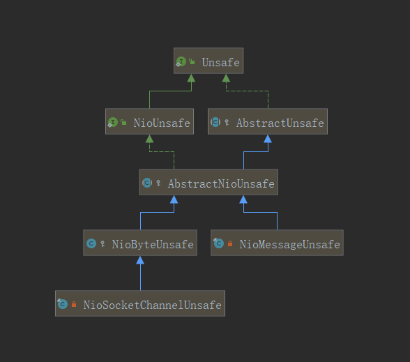
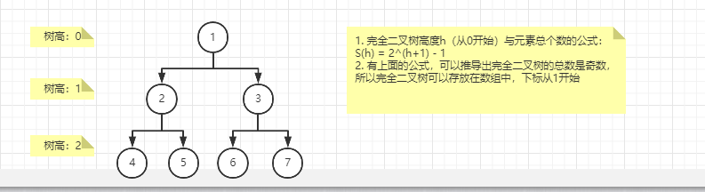

# netty


看懂EventLoop的结构
看懂EventLoopGroup的结构
看懂Promise
看懂selector 的 register部分的代码
看懂read、write部分的代码
看懂read、write处理逻辑及其handler

## 关键类结构

```
NioEventLoopGroup extends MultithreadEventExecutorGroup {
	// 所有的 NioEventLoop
	EventExecutor[] children;
}
```

```
NioEventLoop implements EventLoop, Executor, EventExecutor{
	/**
	 *  在父类：SingleThreadEventExecutor 中的属性
	 *
	 */
	// 只有一个线程的线程池，默认是：ThreadPerTaskExecutor
	// ThreadPerTaskExecutor: 一个任务一个线程
	Executor executor; 
	// 在EventLoop中运行任务的时候，先执行taskQueue中的任务，当taskQueue中的任务执行完了之后，
	// 再执行tailTasks中的任务，用于在所有任务执行完成之后的一些回调处理
	private final Queue<Runnable> taskQueue;
	// 所有任务执行完成之后执行的任务
	private final Queue<Runnable> tailTasks;
	// 定时任务
	PriorityQueue<ScheduledFutureTask<?>> scheduledTaskQueue;
	
	// 父类`AbstractChannel`中的属性
	private volatile EventLoop eventLoop;
	
	// 多路复用器Selector，netty使用的是重写类`SelectedSelectionKeySetSelector`,
	// 这个类中的属性selectedKeys就是下面的引用，其作用应该是为了方便遍历吧
	private Selector selector;
	private Selector unwrappedSelector;
	private SelectedSelectionKeySet selectedKeys;
	
	
	// 构造函数传入一个executor，这个NioEventLoop在运行起来的时候，
	// 会一直占用一个线程，永不释放
	public NioEventLoop(Executor executor){
		this.executor = ThreadExecutorMap.apply(executor, this);
	}
	
	doStartThread(){
		executor.execute(() ->{
			NioEventLoop.this.run();
		});
	}
	
	run(){
		// 无线循环的run方法
		for(;;){
		
			// 1. 轮询注册的事件
			selector.select();
		
			// 2. 处理网络io事件，accept、read、write事件
			processSelectedKeys();
			
			// 3. 运行队列中的任务：
			//  1. 将到期的定时任务从scheduledTaskQueue取出放入到taskQueue
			//  2. 运行taskQueue中的任务
			//  3. 最后执行tailTasks中的任务
			runAllTasks();
		}
	}

}
```
		
```
NioSocketChannel {
	// 父类：AbstractNioChannel 中的属性
	// 该类是`SocketChannel`的父类，意为：能够被多路复用器Selector使用的类
	private final SelectableChannel ch;
	
	// 父类：AbstractChannel 中的属性
	private final Unsafe unsafe;
	// 管道，存放所有的`ChannelHandler`
	private final DefaultChannelPipeline pipeline;
	
	public NioSocketChannel(){
		unsafe = newUnsafe();
		pipeline = newChannelPipeline();
	}
	
	@Override
    protected AbstractNioUnsafe newUnsafe() {
        return new NioSocketChannelUnsafe();
    }
	
	protected DefaultChannelPipeline newChannelPipeline() {
        return new DefaultChannelPipeline(this);
    }
}
```


```
DefaultChannelPipeline implements ChannelPipeline {
	// 链表结构，一个`ChannelHandler`对应一个`AbstractChannelHandlerContext`类
	// 默认实现类`DefaultChannelHandlerContext`
	final AbstractChannelHandlerContext head = new HeadContext(this);
    final AbstractChannelHandlerContext tail = new TailContext(this);

    private final Channel channel;

}
```
DefaultChannelHandlerContext的实现类有3种，DefaultChannelHandlerContext、HeadContext、TailContext。




`Unsafe`接口：这个接口不会被应用代码调用，提供了传输层的一些封装，关于建立连接、注册到多路复用器、读、写、关闭连接等操作。比较关键的实现类：
`NioUnsafe`接口： 关于nio的一些操作
`AbstractUnsafe`类：实现了`Unsafe`的大多数操作
`AbstractNioUnsafe`类：实现了`NioUnsafe`接口的一些操作
`NioByteUnsafe`类： 关于nio读写的逻辑
`NioSocketChannelUnsafe`类： 
`NioMessageUnsafe`类： 关于建立连接相关的操作，如果`NioServerSocketChannel`的建立连接的操作


```
// 一个Channel对应一个ChannelOutboundBuffer，所有被写出的数据都放在这个类中，使用链表连起来
ChannelOutboundBuffer{
	
	private final Channel channel;

	// 最后一个刷新Entry的指针
	private Entry flushedEntry;
	// 第一个未刷新的Entry的指针
	private Entry unflushedEntry;
	// 最后一个未刷新Entry的指针
	private Entry tailEntry;
	
}
```


## ServerBootstrap的关键执行步骤
* newChannel： 创建NioServerSocketChannel，并向pipeline中添加接收连接的`ServerBootstrapAcceptor`

* register：  将NioServerSocketChannel注册到Selector中，这里注册的事件是0，表示没有事件。
	* 注册之后触发`ChannelHandler`的事件：pipeline.invokeHandlerAddedIfNeeded() 、pipeline.fireChannelRegistered	
		
* channel.bind()： 向EventLoop添加bind的任务，任务内容是，
	* 绑定监听的端口 -> pipeline.fireChannelActive -> HeadContext.readIfIsAutoRead -> channel.read() -> pipeline.read() -> HeadContext.read -> unsafe.beginRead() -> 修改Selector中注册的事件为accept

新连接建立连接并注册到workGroup的过程：
	* NioEventLoop#run -> unsafe.read() -> NioMessageUnsafe#read -> NioServerSocketChannel#doReadMessages -> accpet -> pipeline.fireChannelRead -> ServerBootstrapAcceptor#channelRead -> childGroup.register
		-> AbstractChannel#doRegister -> pipeline.invokeHandlerAddedIfNeeded -> pipeline.fireChannelRegistered() -> pipeline.fireChannelActive -> HeadContext#channelActive -> HeadContext.readIfIsAutoRead
		-> pipeline.read() -> HeadContext.read -> unsafe.beginRead() -> 修改Selector中注册的事件为accept
	

## NioChannel.read()方法的心得：
* NioChannel.read()会触发AbstractNioChannel#doBeginRead，顾名思义这个方法是开始读之前的准备工作，将修改自身在Selector的注册事件，如果是NioServerSocketChannel则是注册accept事件，如果是NioSocketChannel则是read事件
* 该方法由 pipeline.fireChannelActive调用
* 在NioServerSocketChannel中，pipeline.fireChannelActive方法是在绑定端口的时候触发，而在NioSocketChannel中是在注册之后就触发


## inBoud事件的传播：
	* 刚开始读的是时候：
	EventLoop.run() -> unsafe.read() -> pipeline.fireChannelRead(byteBuf) -> HeadContext#channelRead -> ctx.fireChannelRead(msg); -> 其它ChannelHandler.channelRead -> TailContext#channelRead -> ReferenceCountUtil.release(msg)
	* 数据读完之后：
	EventLoop.run() -> unsafe.read() -> pipeline.fireChannelReadComplete  -> HeadContext#fireChannelReadComplete -> 其它ChannelHandler.fireChannelReadComplete、 HeadContext#readIfIsAutoRead
	
	* 如果消息传递到了TailContext.channelRead，那么消息将被释放掉
	* 数据读完之后，如果之间有将read事件从selector中注销，那么HeadContext#readIfIsAutoRead又会将read事件注册上

## outBoud事件的传播：
	* 通过context写的方式：
	AbstractChannelHandlerContext#writeAndFlush -> 寻找前面的ChannelHandler.write -> HeadContext.write -> unsafe.write
	* 通过Channel写的方式：
	NioSocketChannel#writeAndFlush -> pipeline.writeAndFlush -> tail.writeAndFlush -> 寻找前面outBoud的ChannelHandler.write -> HeadContext.write -> unsafe.write	

## 异常的传播：

在read的时候出现了异常：
pipeline.fireExceptionCaught -> HeadContext.exceptionCaught -> 寻找inBound的ChannelHandler.exceptionCaught -> TailContext.exceptionCaught
	
## 拆包
ByteToMessageDecoder

行拆包器： LineBasedFrameDecoder

LengthFieldBasedFrameDecoder


## 内存池的管理

netty中采用【伙伴算法】管理内存。


PoolChunk：预先申请16M内存，分割成每页8k，然后组织成一颗完全二叉树。

```
PoolChunk<T> {
	// 如果是堆内存： byte[] memory;
	// 如果是直接内存： ByteArray memory;
	final T memory;

	// 做大树高
	private final int maxOrder;

	// 在完全二叉树中，初始值为该节点在树中的高度
	// 如果 memoryMap[id] = depthMap[i] 表示没有分配
	// 如果 memoryMap[id] > depthMap[i] 至少有一个孩子节点被分配了
	// 如果 memoryMap[id] = maxOrder + 1 已经被全部分配
	// 叶子节点中，如果该叶子被分配了，那么它的 memoryMap[id] = memoryMap[id] + 1， 其所有的父节点的值更新为 = 下一层孩子节点的最大值
	private final byte[] memoryMap;
	// 在完全二叉树中，表示该节点在树中的高度
    private final byte[] depthMap;
	
	// 剩余可用空间
	int freeBytes;
	
	// 本身是一个链表结构
    PoolChunk<T> prev;
    PoolChunk<T> next;
	
	// 
	private final PoolSubpage<T>[] subpages;
	
	
	// 分配内存
	boolean allocate(PooledByteBuf<T> buf, int reqCapacity, int normCapacity, PoolThreadCache threadCache) {
        final long handle;
		// 请求分配的内存，大于page的大小，使用常规分配，否则从subPage中分配
        if ((normCapacity & subpageOverflowMask) != 0) { // >= pageSize
            handle =  allocateRun(normCapacity);
        } else {
            handle = allocateSubpage(normCapacity);
        }

        if (handle < 0) {
            return false;
        }
        ByteBuffer nioBuffer = cachedNioBuffers != null ? cachedNioBuffers.pollLast() : null;
        initBuf(buf, nioBuffer, handle, reqCapacity, threadCache);
        return true;
    }
	
}
```

```
PoolSubpage {
	final PoolChunk<T> chunk; // 对应的chunk
	// 对应chunk中，完全二叉树的下标，即PoolChunk.memoryMap[]的下标
	private final int memoryMapIdx;
	// 位图，表示是否使用，1：使用、0：未使用
	private final long[] bitmap;
	private final int pageSize; // 页大小
	int elemSize; // 每页的大小
    private int maxNumElems; //总共有多少个单位
    private int bitmapLength; //位图大小，maxNumElems >>> 6，一个long有64bit
    private int nextAvail; //下一个可用的单位
    private int numAvail; // 还有多少个可用单位；
	

	// 链表结构
	PoolSubpage<T> prev;
    PoolSubpage<T> next;
}
```

```
PoolChunkList {
	// 
	private PoolChunk<T> head;
	
	// 本身是一个链表结构
	private PoolChunkList<T> prevList;
	private final PoolChunkList<T> nextList;
	
	
	
	// 分配内存，精简后的代码
	boolean allocate(PooledByteBuf<T> buf, int reqCapacity, int normCapacity, PoolThreadCache threadCache) {
		// 便利PoolChunk链表，调用分配算法
        for (PoolChunk<T> cur = head; cur != null; cur = cur.next) {
            if (cur.allocate(buf, reqCapacity, normCapacity, threadCache)) {
				// 如果剩余可用空间，小于最小的阀值，将这个PoolChunk从本PoolChunkList中移除，放入它后面的符合的空间利用率的PoolChunkList中
                if (cur.freeBytes <= freeMinThreshold) {
                    remove(cur);
                    nextList.add(cur);
                }
                return true;
            }
        }
        return false;
    }
	
	// 
	private void remove(PoolChunk<T> cur){
	}
	
	// 判断是否符合这个
	void add(PoolChunk<T> chunk) {
        if (chunk.freeBytes <= freeMinThreshold) {
            nextList.add(chunk);
            return;
        }
        add0(chunk);
    }
}
```

在PoolArena中，根据PoolChunk的空间利用率，将PoolChunkList是使用链表连起来的： qInit -> q000 <-> q025 <-> q050 <-> q075 <-> q100


```
PoolArena {
	private final PoolChunkList<T> qInit;
	private final PoolChunkList<T> q000;
	private final PoolChunkList<T> q025;
	private final PoolChunkList<T> q050;
    private final PoolChunkList<T> q075;
    private final PoolChunkList<T> q100;
	
	// 被缓存在ThreadLocal中次数，表示有几个线程在使用这个对象，在分配内存的时候，会挑选线程使用次数最少的来使用，以减少锁竞争
	final AtomicInteger numThreadCaches = new AtomicInteger();
	
	PoolArena(){
		// PoolChunk的使用率
		// qInit -> q000 <-> q025 <-> q050 <-> q075 <-> q100
		q100 = new PoolChunkList<T>(this, null, 100, Integer.MAX_VALUE, chunkSize);
        q075 = new PoolChunkList<T>(this, q100, 75, 100, chunkSize);
        q050 = new PoolChunkList<T>(this, q075, 50, 100, chunkSize);
        q025 = new PoolChunkList<T>(this, q050, 25, 75, chunkSize);
        q000 = new PoolChunkList<T>(this, q025, 1, 50, chunkSize);
        qInit = new PoolChunkList<T>(this, q000, Integer.MIN_VALUE, 25, chunkSize);
		q100.prevList(q075);
        q075.prevList(q050);
        q050.prevList(q025);
        q025.prevList(q000);
        q000.prevList(null);
        qInit.prevList(qInit);
	}
	
	
	// Method must be called inside synchronized(this) { ... } block
    private void allocateNormal(PooledByteBuf<T> buf, int reqCapacity, int normCapacity, PoolThreadCache threadCache) {
		// 根据下面的利用率顺序来分配内存，如果有一个分配成功则返回
        if (q050.allocate(buf, reqCapacity, normCapacity, threadCache) ||
            q025.allocate(buf, reqCapacity, normCapacity, threadCache) ||
            q000.allocate(buf, reqCapacity, normCapacity, threadCache) ||
            qInit.allocate(buf, reqCapacity, normCapacity, threadCache) ||
            q075.allocate(buf, reqCapacity, normCapacity, threadCache)) {
            return;
        }

		// 如果没有分配成功，新增一个PoolChunk，并将新增的chunk添加到qInit中，再分配内存
        PoolChunk<T> c = newChunk(pageSize, maxOrder, pageShifts, chunkSize);
        boolean success = c.allocate(buf, reqCapacity, normCapacity, threadCache);
        assert success;
        qInit.add(c);
    }
	
}
```

PoolArena中根据PoolChunk的使用率分类PoolChunkList的目的：
	* 随时使用时间的推移，内存碎片会越来约多，要想申请一块比较大的内存的失败率也就越高，根据内存使用率分类，分配内存的时候优先分配使用率小的，提高分配成功率


```
PooledByteBufAllocator {

	private final PoolArena<byte[]>[] heapArenas;
    private final PoolArena<ByteBuffer>[] directArenas;
	
	// 在分配内存的时候，会挑选一个被线程使用最少的PoolArena放入本地线程变量中
	private final PoolThreadLocalCache threadCache;
	
	
	@Override
    protected ByteBuf newHeapBuffer(int initialCapacity, int maxCapacity) {
		// 从本地变量中拿出PoolArena
        PoolThreadCache cache = threadCache.get();
        PoolArena<byte[]> heapArena = cache.heapArena;

        final ByteBuf buf;
        if (heapArena != null) {
            buf = heapArena.allocate(cache, initialCapacity, maxCapacity);
        } else {
            buf = PlatformDependent.hasUnsafe() ?
                    new UnpooledUnsafeHeapByteBuf(this, initialCapacity, maxCapacity) :
                    new UnpooledHeapByteBuf(this, initialCapacity, maxCapacity);
        }

        return toLeakAwareBuffer(buf);
    }
}


final class PoolThreadLocalCache extends FastThreadLocal<PoolThreadCache> {
		
	@Override
    protected synchronized PoolThreadCache initialValue() {
		final PoolArena<byte[]> heapArena = leastUsedArena(heapArenas);
        final PoolArena<ByteBuffer> directArena = leastUsedArena(directArenas);
		
		return new PoolThreadCache(heapArena, directArena, 0, 0, 0, 0, 0);
	}

	// 挑选一个线程使用最少的PoolArena，并放入本地线程变量中
	private <T> PoolArena<T> leastUsedArena(PoolArena<T>[] arenas) {
		if (arenas == null || arenas.length == 0) {
			return null;
		}

		PoolArena<T> minArena = arenas[0];
		for (int i = 1; i < arenas.length; i++) {
			PoolArena<T> arena = arenas[i];
			if (arena.numThreadCaches.get() < minArena.numThreadCaches.get()) {
				minArena = arena;
			}
		}

		return minArena;
	}

}
```

```
PooledUnsafeHeapByteBuf {
	
	/**
	 *  父类`PooledByteBuf`中的属性
	 */
	private final Handle<PooledByteBuf<T>> recyclerHandle;

    protected PoolChunk<T> chunk; // 属于那个内存块
    protected long handle;
    protected T memory;  // 所属PoolChunk的内存的引用
    protected int offset; // 在memory中，可使用空间的起始下标
    protected int length; // 在memory中，可使用空间的大小
    int maxLength;        // 在memory中，最大可使用空间的大小，在分配内存的时候是安装最大空间分配的
    PoolThreadCache cache;
    ByteBuffer tmpNioBuf;
    private ByteBufAllocator allocator;
	
	/**
	 *  父类`AbstractByteBuf`中的属性
	 */
	private int maxCapacity;
	
	
	private void init0(PoolChunk<T> chunk, ByteBuffer nioBuffer,
                       long handle, int offset, int length, int maxLength, PoolThreadCache cache) {
        assert handle >= 0;
        assert chunk != null;

        this.chunk = chunk;
        memory = chunk.memory;
        tmpNioBuf = nioBuffer;
        allocator = chunk.arena.parent;
        this.cache = cache;
        this.handle = handle;
        this.offset = offset;
        this.length = length;
        this.maxLength = maxLength;
    }
	
}
```

新建多个PoolArena的目的：
	* 最好每个线程使用一个PoolArena，防止锁竞争


## 完全二叉树



1. 完全二叉树高度h（从0开始）与元素总个数的公式： S(h) = 2^(h+1) - 1
2. 有上面的公式，可以推导出完全二叉树的总数是奇数，所以完全二叉树可以存放在数组中，下标从1开始

补充：
	* 异或运算【^】：相同为0，不同为1


## 应用场景
rpc框架doubbo、Redisson 
游戏服务器
推送服务

## 问题
1. 如果bossGroup、workGroup使用同一个group，并且线程池的大小为1，会不会出现只能建立建立，没法处理客户连接的读写的情况
	答：不会。
2. 新建立的连接如何注册到其它的eventLoopGroup的？
	答：通过ServerBootstrapAcceptor注册
3. 在写数据的时候，如果只调用write方法，不调用flush方法，数据会被发送到对端吗？
	答： 不会。且调用一次flush，则会将之前累积的数据都刷出去
4. EventLoop里面write事件永远不会触发吗？	

5. WriteBufferWaterMark是做什么用的？
	答： 

6. 将io线程与业务线程分开的好处是什么，目的是什么？
	答：	预防业务代码太慢阻塞io  导致io过多丢弃
			充分利用cpu的并发性，从网络io读取数据并不消耗cpu，只是拆包、粘包的时候消耗cpu，让io读取与业务数据并发执行
	


缓存行对齐

责任链、模板、策略


小端序、大端序

ArrayList深入了解
mpsc队列

tesseract-job-admin

## 相关文章

jemalloc： https://blog.csdn.net/stillingpb/article/details/50937366


