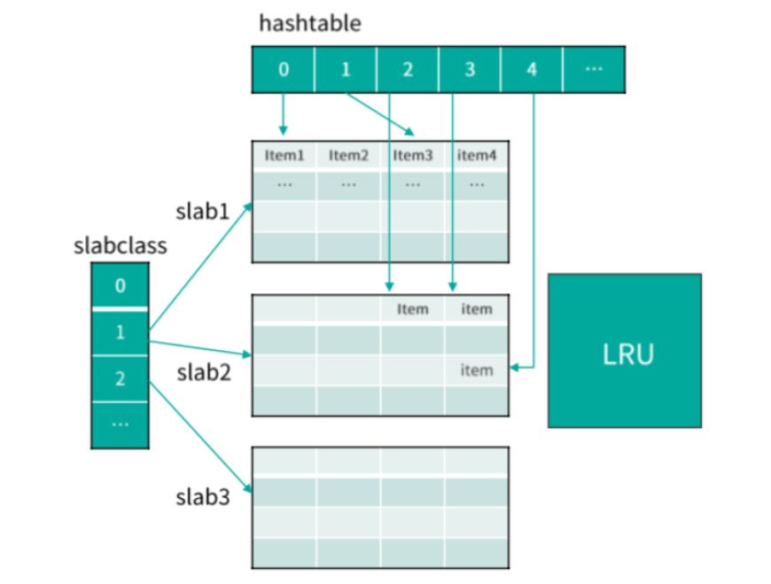
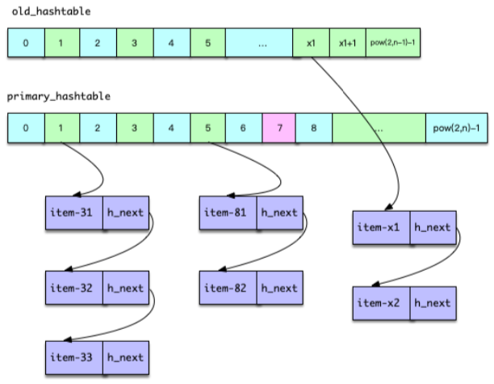
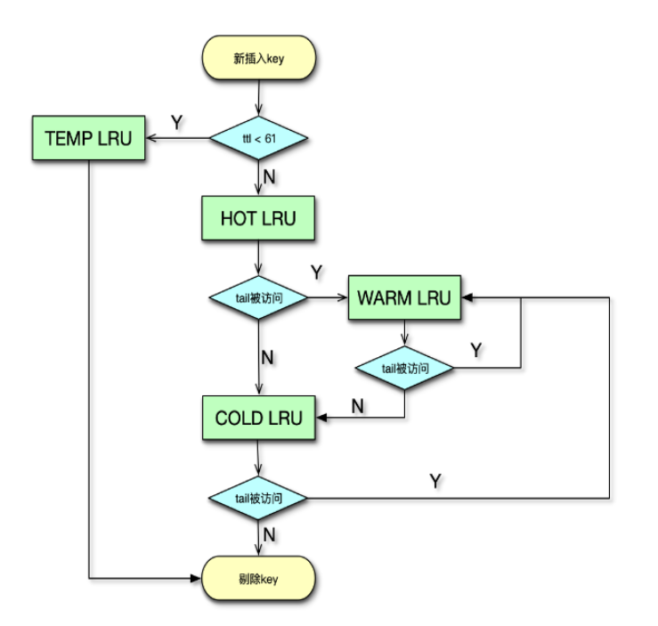

# memcached系统架构

## 1. 系统架构

1. 系统架构组成，5部分：

   * 网络处理模块：基于 Libevent 实现了网络处理模块，

   * 多线程处理模块：通过多线程并发处理用户请求
   * 哈希表：基于哈希表对 key 进行快速定位
   * LRU：基于 LRU 来管理冷数据的剔除淘汰
   * slab 内存分配：基于 slab 机制进行快速的内存分配及存储

### 1.1  网络处理模块

  MC基于libevent开发实现了多线程网络编程。MC的多线程网络模型分为主线程和工作线程。在 Linux 下，通常使用 epoll

### 1.2 多线程处理模块

	* 用于 IO 的主线程： 负责监听及建立连接
	* 用于IO的工作线程：负责对建立的连接进行网络 IO 读取、命令解析、处理及响应
	*  Item 爬虫线程
	* LRU 维护线程
	* 哈希表维护线程等

### 1.3 哈希表

> item锁：https://www.cnblogs.com/kuzhon/articles/5560236.html

 1. Mc 通过哈希表即 Hashtable 来快速定位 key

 2. 散列算法：Murmur3 或者 Jenkins

 3. hash冲突的处理：

    * 单向链表，插入时采用头部插入法插入链表中

    

 4. hash扩容时机：当表中 Item 数量大于哈希表 bucket 节点数的 1.5 倍时，就对哈希表进行扩容

 5. hash表长度：

    - 2的n次方，方便使用位运算定位数组的位置，即`hashValue & hashMask`
    - 最大长度：2 的 32 次方
    - 最多存储item个数（即`key/value`的个数）: 由于扩容机制，所以最大存储数量：2^32 * 1.5 ≈ 65亿
    - 修改最大存储：修改源码`HASHPOWER_MAX`的值

	6. hash扩容：

    * Mc 的哈希扩容是通过哈希维护线程进行处理的

	7. 安全性：

    * 锁的级别：段级别和全局级别。在平时(不进行哈希表扩展时)，使用段级别的锁。在扩展哈希表时，使用全局级别的锁
    * 段级别锁：
      * 一个段对应有多个桶
      * 段级别锁的数量在程序的一开始就已经确定了，所以随着哈希表的扩展，越来越多的桶对应一个段

	8. hash扩容步骤：

    * 开始扩容时，哈希维护线程暂停：IO 工作线程、辅助线程、 LRU 维护线程、slab 维护线程、LRU 爬虫线程

    * 待这些线程暂停后，哈希维护线程会将当前的主哈希表设为旧哈希表，然后将新的主哈希表扩容之前的 2 倍容量
    * 然后，工作线程及辅助线程继续工作，同时哈希维护线程开始逐步将 Item 元素从旧哈希表迁移到主哈希表。每次按 **桶链表纬度** 迁移，即一次迁移一个桶里单向链表的所有 Item 元素
    * 迁移过程中，根据迁移位置，用户请求会同时查旧表和新的主表，当数据全部迁移完成，所有的操作就重新回到主表中进行

    

### 1.4 LRU机制

> 参考： https://www.freesion.com/article/9030435024/

1.  每个item 有一个 flag，标识其活跃程度：

   * FETCHED： 如果一个 item 有请求操作，其 flag 等于 FETCHED
   * ACTIVE： 如果一个 item 第二次被请求则会标记为 ACTIVE；当一个 item 发生 bump（碰撞） 或被移动了，flag 会被清空
   * INACTIVE： 不活跃状态

   

 1. 启用分段 LRU 之前，每个 slabclass id 只对应一个 COLD  LRU，在内存不足时，会直接从 COLD LRU 剔除数据

 2. 启用分段LRU之后，每个 slabclass id 就有 TEMP、HOT、WARM 和 COLD  四个 LRU。

    * 分段的意义：主要是为了降低锁竞争，提升效率

    * TEMP LRU： 
      * TEMP LRU 中 Item 剩余过期时间通常很短，默认是 61 秒以内
      * 该列队中的 Item 永远不会发生在队列内搬运，也不会迁移到其他队列
      * 在插入新 key/value 时，如果 key 的剩余过期时间小于 61 秒，则直接进入 TEMP LRU

    * HOT LRU：
      * 内部不搬运，当队列满时，如果队尾 Item 是 Active 状态，即被访问过，那么会迁移到 WARM 队列，否则迁移到 COLD 队列
    * WARM LRU
      * 队列的 Item 被再次访问，就搬到队首，否则迁移到 COLD 队列
    * COLD LRU
      * 存放的是最不活跃的 Item，一旦内存满了，队尾的 Item 会被剔除
      * 如果 COLD LRU 里的 Item 被再次访问，会迁移到 WARM LRU

### 1.5 slab 分配机制

 	1. 采用slab机制分配内存，而不是直接使用malloc、free来分配内存的原因：
     * 使用malloc、free分配内存，内存碎片会原来越多，严重增加操作系统内存管理的负担。碎片的不断产生，还会导致内存浪费，碎片整理复杂，从而内存分配变慢
 	2. slab分配过程：
     * 在 Mc 启动时，会创建 64 个 slabclass
     * 每个 slabclass 会根据需要不断分配默认大小为 1MB 的 slab
     * 每个 slab 又被分为相同大小的 chunk，chunk 就是 Mc 存储数据的基本存储单位
     *  chunk 中通过 Item 结构存 key/value 键值对
     * Item 结构体的头部存链表的指针、flag、过期时间

## 问题
1. 采用slab机制分配内存，而不是直接使用malloc、free来分配内存的原因?
   * 答：使用malloc、free分配内存，内存碎片会原来越多，严重增加操作系统内存管理的负担。碎片的不断产生，还会导致内存浪费，碎片整理复杂，从而内存分配变慢
