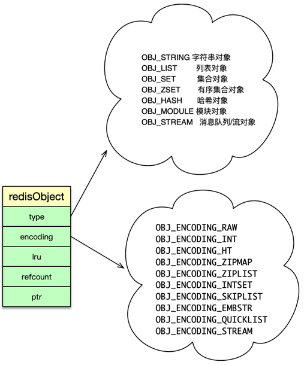
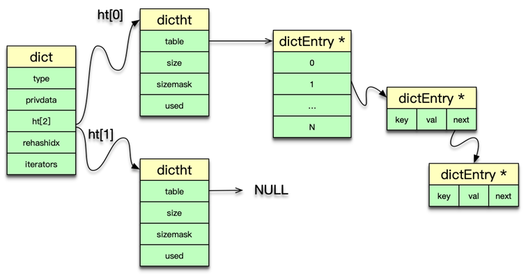
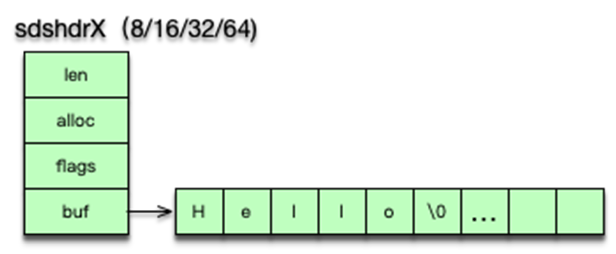
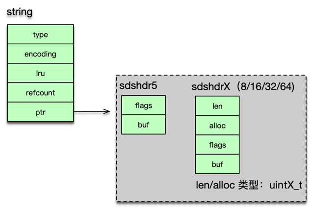

# Redis 内部数据结构

## 1. redisDB

1. 一个 Redis 默认最多支持 16 个 DB
2. redisDb 主要包括 2 个核心 dict 字典（dict、expire）、3 个非核心 dict 字典（blocking_keys、ready_keys、watched_keys）、dbID 和其他辅助属性
3. dict：
   * 主 dict 字典用来存储当前 DB 中的所有数据，它将 key 和各种数据类型的 value 关联起来，该 dict 也称 key space
4. expire：
   * 过期字典用来存储过期时间 key，存的是 key 与过期时间的映射
   * 日常的数据存储和访问基本都会访问到 redisDb 中的dict、expire字典
5. blocking_keys：
   * 阻塞 dict。存储的是处于阻塞状态的 key 及 client 列表
   * 执行redis的阻塞命令blpop、brpop 或者 brpoplpush 时，如果对应的 list 列表为空，Redis 就会将对应的 client 设为阻塞状态，同时将该 client 添加到 DB 中 blocking_keys 这个阻塞 dict。
   * 当有其他调用方在向某个 key 对应的 list 中增加元素时，redis会检查**blocking_keys**是否包含这个key，会将这个key加入到**ready_key**这个dict中。
6. ready_keys
   * 解除阻塞 dict
7. watched_keys：
   * 当 client 使用 watch 指令来监控 key 时，这个 key 和 client 就会被保存到 watched_keys 这个 dict 中

## 2. redisObject

> Redis 中所有数据类型都是存放在一个叫 redisObject 的结构中。
>
> redisObject 由 5 个字段组成

1. type：即 Redis 对象的数据类型，目前支持 7 种 type 类型
2. encoding：Redis 对象的内部编码方式，即内部数据结构类型，目前支持 10 种编码方式
3. LRU：存储的是淘汰数据用的 LRU 时间或 LFU 频率及时间的数据。
4. refcount：记录 Redis 对象的引用计数，用来表示对象被共享的次数，共享使用时加 1，不再使用时减 1，当计数为 0 时表明该对象没有被使用，就会被释放，回收内存。
5. ptr：它指向对象的内部数据结构。比如一个代表 string 的对象，它的 ptr 可能指向一个 sds 或者一个 long 型整数。

## 3. dict

1. Redis 中的 dict，类似于 Memcached 中 hashtable。

2. dict 字典中，有一个长度为 2 的哈希表数组，日常访问用 0 号哈希表，如果 0 号哈希表元素过多，则分配一个 2 倍 0 号哈希表大小的空间给 1 号哈希表，然后进行逐步迁移，rehashidx 这个字段就是专门用来做标志迁移位置的。

3. 采用单向链表来解决 hash 冲突问题。

4. dict 中还有一个重要字段是 type，它用于保存 hash 函数及 key/value 赋值、比较函数

5. dictht 是以 dictEntry 来存 key-value 映射的。其中 key 是 sds 字符串，value 为存储各种数据类型的 redisObject 结构。

6. dict 可以作为 set 集合的内部数据结构

7. 在哈希的元素数超过 512 个，或者哈希中 value 大于 64 字节，dict 还被用作为哈希类型的内部数据结构

## 4. sds

1. len ：为字符串实际长度。
   * 直接存放字符串长度的好处：
     * 字符串长度不用遍历，可直接获得，修改和访问都很方便
     * 由于 sds 中字符串存在 buf 数组中，长度由 len 定义，而不像传统字符串遇 0 停止，所以 sds 是二进制安全的，可以存放任何二进制的数据
   * sds 会根据字符串实际的长度，选择不同的数据结构，以更好的提升内存效率
   * 当前 sdshdr 结构分为 5 种子类型，分别为 sdshdr5、sdshdr8、sdshdr16、sdshdr32、sdshdr64。其中 sdshdr5 只有 flags 和 buf 字段
   * 
2. alloc 当前字节数组总共分配的内存大小
3. flags 记录当前字节数组的属性
4. buf 是存储字符串真正的值及末尾一个 \0

## 5. ziplist

## 6. quicklist

## 7. zskiplist

## 总结：

string 字符串： sds
list：quicklist
set：Redis 采用 dict 来进行存储
sorted set 有序集合类型： 如果元素数小于 128 且元素长度小于 64，则使用 ziplist 存储，否则使用 zskiplist 存储
hash类型：如果元素数小于 512，并且元素长度小于 64，则用 ziplist 存储，否则使用 dict 字典存储
hyperloglog： 采用 sds 简单动态字符串存储
geo： 如果位置数小于 128，则使用 ziplist 存储，否则使用 zskiplist 存储
bitmap： 采用 sds 简单动态字符串存储

hGetAll key： 会遍历整个dict，即使不是自己key的也会遍历比较一下，会存在性能问题
