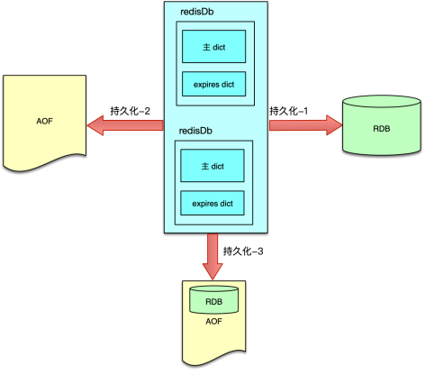
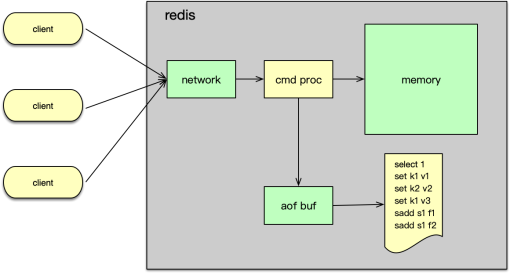

# redis持久化

Redis 持久化是一个将内存数据转储到磁盘的过程。Redis 目前支持 RDB、AOF，以及混合存储三种模式。

## 1. RDB

1. 简介：

   * Redis 的 RDB 持久化是以快照的方式将内存数据存储到磁盘

   * 在需要进行 RDB 持久化时，Redis 会将内存中的所有数据以二进制的格式落地，每条数据存储的内容包括过期时间、数据类型、key，以及 value。

   * 当 Redis 重启时，如果 appendonly 关闭，则会读取 RDB 持久化生成的二进制文件进行数据恢复。

2. 触发构建 RDB 的场景主要有以下四种：

   * **通过 save 或 bgsave 命令进行主动 RDB 快照构建**。客户端调用

   * **利用配置 save m n 来进行自动快照生成**。它是指在 m 秒中，如果插入或变更 n 个 key，则自动触发 bgsave。由于峰值期间，Redis 的压力大，变更的 key 也比较多，如果再进行构建 RDB 的操作，会进一步增加机器负担，对调用方请求会有一定的影响，所以线上使用时需要谨慎

   * 主从复制，如果从库需要进行全量复制，此时主库也会进行 bgsave 生成一个 RDB 快照。

   * 在运维执行 flushall 清空所有数据，或执行 shutdown 关闭服务时，也会触发 Redis 自动构建 RDB 快照。

3. 持久化流程：

   * save 是在主进程中进行 RDB 持久化的，持久化期间 Redis 处于阻塞状态，不处理任何客户请求，所以一般使用较少

   * 而 bgsave 是 fork 一个子进程，然后在子进程中构建 RDB 快照，构建快照的过程不直接影响用户的访问，但仍然会增加机器负载。线上 Redis 快照备份，一般会选择凌晨低峰时段，通过 bgsave 主动触发进行备份

4. 优点：

   * 采用二进制方式存储内存数据，文件小，且启动时恢复速度快

5. 缺点：

   * 只能存储构建快照时刻的数据，无法记录之后数据的变更
   * 每次构建是全量构建，耗时长
   * 构建快照属于cpu密集型操作，构建时刻影响系统性能
   * 采用二进制存储，可读性差，不同版本之间存在兼容性问题

## 2. AOF

1. 简介：

   * Redis 的 AOF 持久化是以命令追加的方式进行数据落地的
   * 通过 appendonly 配置

2. 持久化流程：

   - Redis 在处理完写指令后，首先将写指令写入 AOF 缓冲，然后通过 server_cron 定期将 AOF 缓冲写入文件缓冲。
   - 最后按照配置策略进行 fsync，将文件缓冲的数据真正同步写入磁盘。

   

3. 同步文件缓冲策略：通过appendfsync设置，三种：

   * no，Redis 不主动使用 fsync 进行文件数据同步落地，而是由操作系统的 write 函数去确认同步时间，在 Linux 系统中大概每 30 秒会进行一次同步，如果 Redis 发生 crash，就会造成大量的数据丢失
   * always，即每次将 AOF 缓冲写入文件，都会调用 fsync 强制将内核数据写入文件，安全性最高，但性能上会比较低效，而且由于频繁的 IO 读写，磁盘的寿命会大大降低
   * everysec。即每秒通过 BIO 线程进行一次 fsync。这种策略在安全性、性能，以及磁盘寿命之间做较好的权衡，可以较好的满足线上业务需要

4. 随着时间的推移，aof文件会越来越大，此时可以通过定期rewrite解决，rewrite的触发：

   * 运维执行 bgrewiretaof 命令
   * 配置重写策略进行

5. aof rewrite流程：

   * fork 一个子进程
   * 轮询所有的redisdb快照，写入新的AOF临时文件
   * 子进程rewriteaof时，主进程继续响应用户请求，执行完毕后将写指令写入旧的 AOF 文件和 **rewrite 缓冲**
   * 子进程将 RedisDB 中数据落地完毕后，通知主进程，AOF **rewite 缓冲**数据写入 AOF 临时文件
   * 用新的 AOF 文件替换旧的 AOF 文件

6. 优点：

   * 录全部的最新内存数据，最多也就是 1-2 秒的数据丢失
   * aof文件格式统一，兼容性高
   * 可读性好

7. 缺点：

   * aof文件大，恢复慢

## 3. 混合持久化

1. 简介：
   * Redis 在 4.0 版本之后，引入了混合持久化方式，而且在 5.0 版本后默认开启。
   * 混合模式一体化使用 RDB 和 AOF，综合 RDB 和 AOF 的好处
   * 使用 aof-use-rdb-preamble 配置来明确打开混合持久化模式
2. 持久化流程：
   * 主进程fork 一个子进程
   * 子进程首先将内存数据以 RDB 的二进制格式写入 AOF 临时文件中
   * 再将落地期间缓冲的新增写指令，以命令的方式追加到临时文件
3. 优点：
   * 包含全量数据，加载速度快
4. 缺点：
   * 头部的 RDB 格式兼容性和可读性较差

